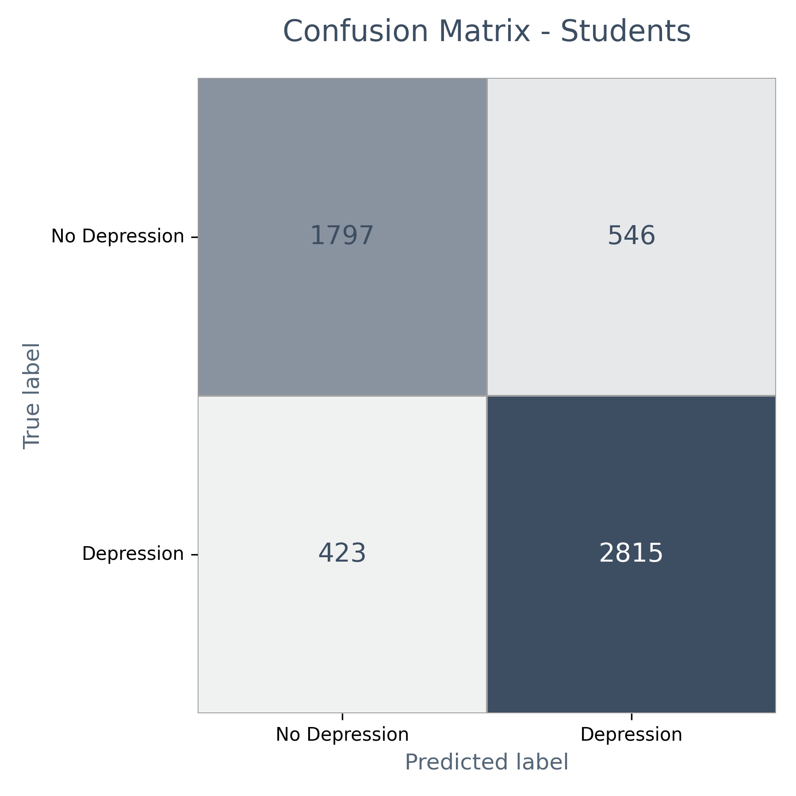
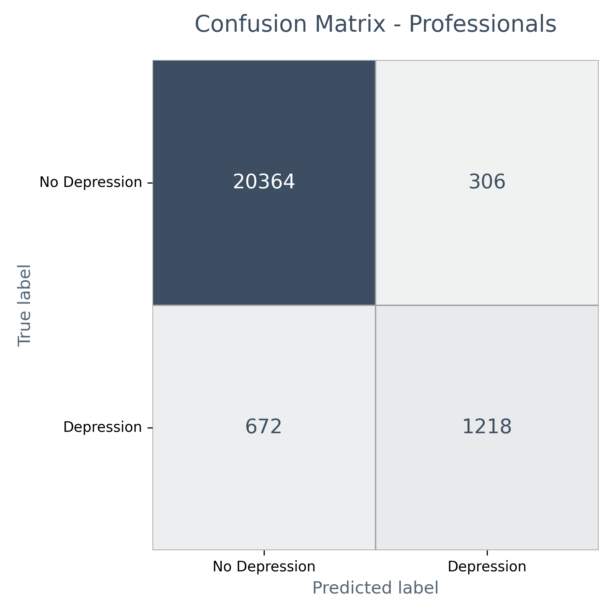

# 2_lr_confusion_report

## Logistic Regression 분류 결과 및 혼동 행렬 시각화

### 1. 모델 학습 및 평가 개요

- 정신건강 자가진단 데이터셋에서 학생과 직장인 그룹으로 분리  
- Logistic Regression 모델을 각각 학습 및 평가  
- 타겟 변수: Depression (우울증 여부)  
- 주요 평가 지표: Accuracy, Precision, Recall, F1-score  
- 혼동 행렬 시각화 포함

### 2. 평가 결과 - 학생 모델

| 클래스          | Precision | Recall | F1-score | Support |
|-----------------|-----------|--------|----------|---------|
| No Depression   | 0.81      | 0.77   | 0.79     | 2343    |
| Depression      | 0.84      | 0.87   | 0.85     | 3238    |
| **Accuracy**    |           |        | 0.83     | 5581    |
| Macro avg       | 0.82      | 0.82   | 0.82     | 5581    |
| Weighted avg    | 0.83      | 0.83   | 0.83     | 5581    |

### 3. 평가 결과 - 직장인 모델

| 클래스          | Precision | Recall | F1-score | Support |
|-----------------|-----------|--------|----------|---------|
| No Depression   | 0.97      | 0.99   | 0.98     | 20670   |
| Depression      | 0.80      | 0.64   | 0.71     | 1890    |
| **Accuracy**    |           |        | 0.96     | 22560   |
| Macro avg       | 0.88      | 0.81   | 0.85     | 22560   |
| Weighted avg    | 0.95      | 0.96   | 0.95     | 22560   |

### 4. 혼동 행렬 이미지

- Students Logistic Regression  
    

- Professionals Logistic Regression  
    

---

### 5. 참고 및 해석

- 클래스 라벨 0: No Depression  
- 클래스 라벨 1: Depression  
- 학생 모델은 균형 잡힌 성능으로 우울증과 비우울증을 잘 구분함  
- 직장인 모델은 우울증 환자에 대한 재현율(Recall)이 상대적으로 낮음(0.64)으로 보완 가능성 존재  
- 혼동 행렬을 통해 실제 오분류 유형을 세부적으로 분석하고 모델 개선 전략 수립 권장
