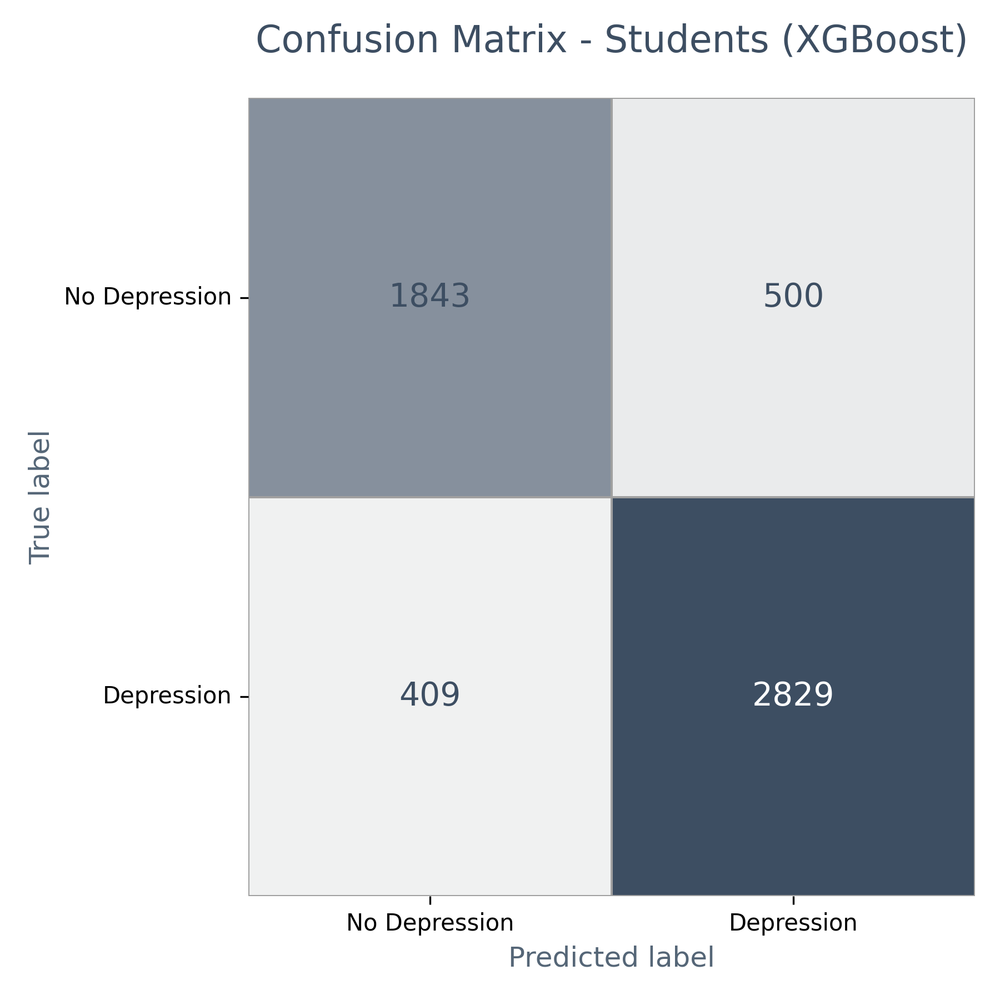
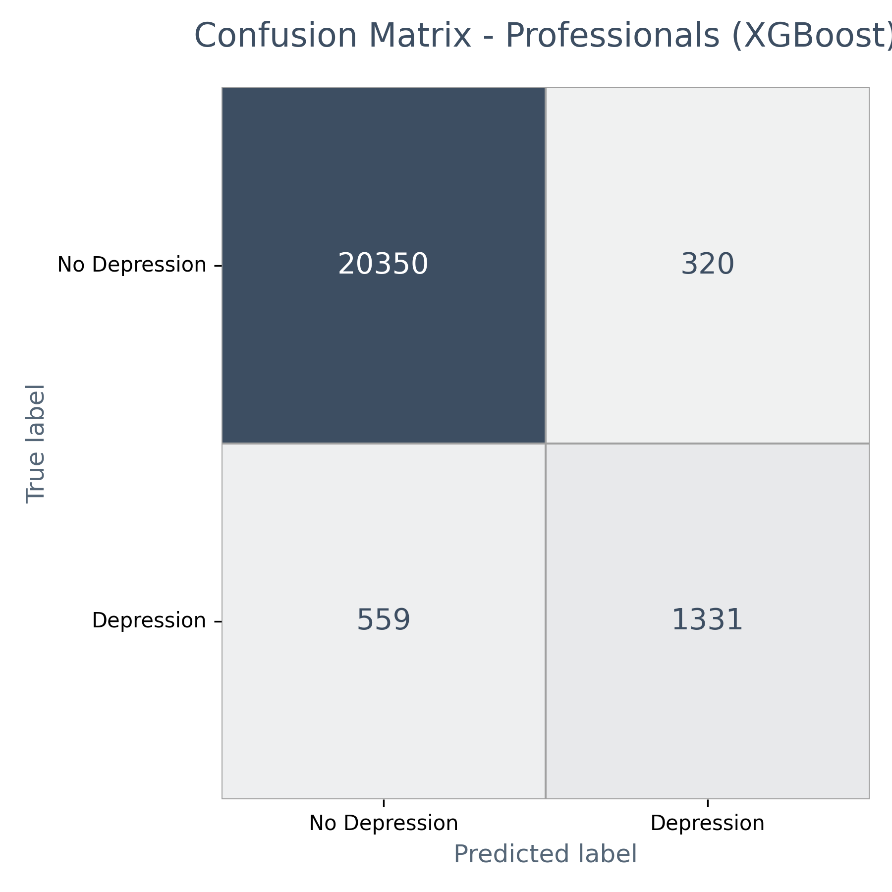

# XGBoost 분류 결과 및 혼동 행렬 시각화

## 1. 모델 학습 및 평가 개요

- 정신건강 자가진단 데이터셋에서 학생과 직장인 그룹으로 분리  
- XGBoost 분류 모델을 각각 학습 및 평가  
- 타겟 변수: Depression (우울증 여부)  
- 주요 평가 지표: Accuracy, Precision, Recall, F1-score  
- 혼동 행렬 시각화 포함  

## 2. 평가 결과 - 학생 모델

| 클래스          | Precision | Recall | F1-score | Support |
|-----------------|-----------|--------|----------|---------|
| No Depression   | 0.82      | 0.79   | 0.80     | 2343    |
| Depression      | 0.85      | 0.87   | 0.86     | 3238    |
| **Accuracy**    |           |        | 0.84     | 5581    |
| Macro avg       | 0.83      | 0.83   | 0.83     | 5581    |
| Weighted avg    | 0.84      | 0.84   | 0.84     | 5581    |

## 3. 평가 결과 - 직장인 모델

| 클래스          | Precision | Recall | F1-score | Support |
|-----------------|-----------|--------|----------|---------|
| No Depression   | 0.97      | 0.98   | 0.98     | 20670   |
| Depression      | 0.81      | 0.70   | 0.75     | 1890    |
| **Accuracy**    |           |        | 0.96     | 22560   |
| Macro avg       | 0.89      | 0.84   | 0.87     | 22560   |
| Weighted avg    | 0.96      | 0.96   | 0.96     | 22560   |

## 4. 혼동 행렬 이미지

- Students XGBoost  
    

- Professionals XGBoost  
    

---

## 5. 참고 및 해석

- 클래스 라벨 0: No Depression  
- 클래스 라벨 1: Depression  
- 학생 모델은 전반적으로 균형 잡힌 성능 보여줌  
- 직장인 모델은 우울증군 재현율(Recall)이 다소 낮아 보완 필요성 존재  
- 혼동 행렬을 통한 오분류 유형 분석과 추가 개선 권장  
